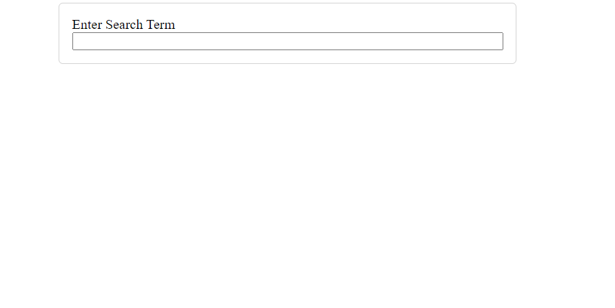
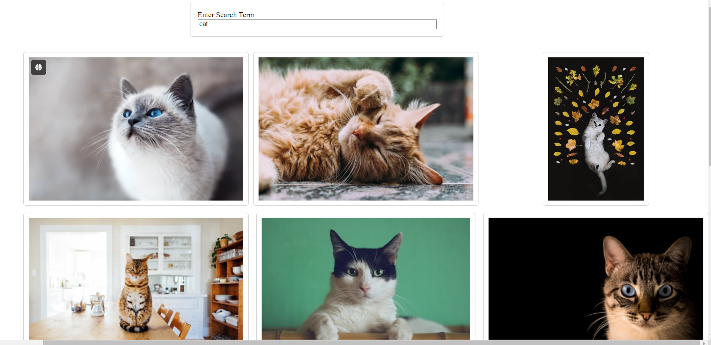

# Image Search Web App

This is a simple image search web application built using React, Axios, and the Unsplash API. The application allows users to search for images by entering a search term, and the app will display a list of images that match the search term.

## Table of Contents

1. [Features](#features)
2. [Installation](#installation)
3. [Usage](#usage)
4. [Project Structure](#project-structure)
5. [Screenshots](#screenshots)
6. [License](#license)

## Features

- Search for images using the Unsplash API.
- Responsive design.
- Clean and minimalistic UI.

## Installation

Follow these steps to set up the project locally.

 ### 1. Clone the repository

```bash
git clone https://github.com/Srikar4510/ImageSearch.git
cd ImageSearch
```
### 2. Install dependencies
Make sure you have Node.js installed. Then, install the necessary packages by running:

```bash
npm install
```
###  3. Get Unsplash API Key
Sign up at Unsplash Developer to get your API key.
Replace the Client-ID in the searchImages function inside api.js with your API key.
###  4. Run the application
```bash
npm start
```
This will start the application, and you can view it in your browser at http://localhost:5173.

## Usage
Open the application in your browser.
Enter a search term in the input field.
Press "Enter" to submit the form and fetch images from Unsplash.
The images will be displayed below the search bar.

## Project Structure
```bash
ImageSearch/
│
├── public/
│   └── index.html
│
├── src/
│   ├── components/
│   │   ├── ImageList.js
│   │   ├── ImageShow.js
│   │   └── SearchBar.js
│   ├── api.js
│   ├── App.css
│   ├── App.js
│   ├── index.css
│   └── index.js
│
├── package.json
└── README.md
```
## Screenshots

### Initial State


### Displaying Search Results


## License
This project is licensed under the MIT License. See the LICENSE file for details.
